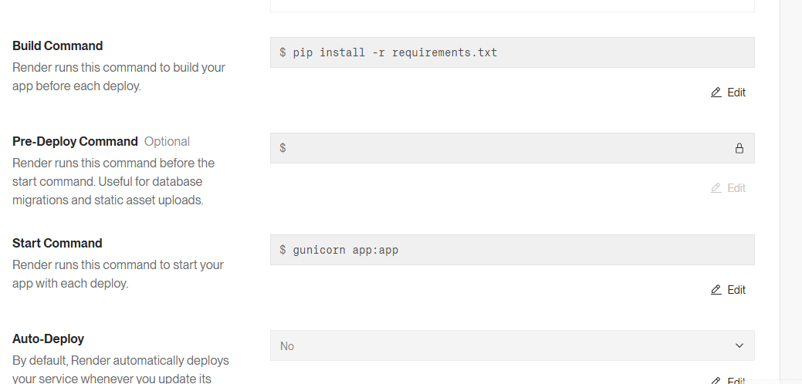

# Hello world whit Python
## Results
<p align="center">
   
</p>

This is a basic "Hello World" program built using the Flask framework. It serves a simple web page that manipulates the DOM and displays a typical "Hello World" message to the user.

## :open_book: How to use
* Clone the repository

    ```
    git clone https://github.com/XavierCuases/Repository5pyflask.git
    ```
> [!NOTE]
Since the application is a Flask web application, it needs to be served through a web server. In this example, we will use the Flask development server or Docker for easy local deployment.

Once you clone the project, follow these steps:

1. Open the project in VSCode.
2. Ensure that you have installed the required dependencies by running:
   pip install -r requirements.txt
3.   Inside the editor, open the app.py file, which contains the Flask app.
4. Run the application with the following command
   python app.py
5. Once the server is running, open your browser and go to http://127.0.0.1:5000 to see the application.


## :rocket: How to run in docker
### Pre-requisites
* Docker - DockerDesktop installed
* DockerHub account

### link image docker hub 


### Download image

[ImagenPY](https://hub.docker.com/r/xaviercuases/ejercicio5pyflask "click for visit")
```
docker pull xaviercuases/ejercicio5pyflask
```
> [!IMPORTANT]
> Flask, by default, runs on port 5000 when using its built-in development server. This is intended for local development and testing purposes. If you need to change the port, Flask allows you to specify a different one when running the application.
### Run image
```
docker run --name <NEWCONTAINERNAME> -d -p 5000:5000 <IMAGENAME>
```
> [!TIP]
> The name of the downloaded image must match the one placed in the previous command, for this you can verify it using the **docker images** command. Additionally, you must check that there is no other container with the same name as the one placed in the command.
### View the results
Open new window browser and search localhost:5000

[View results](#results)

## :light_rail: PAAS Deploy with docker (render)
For its deployment in a PAAS we will rely on Render and its easy implementation thanks to its container management. 


This project is deployed on Render, which supports multiple programming languages:

Docker
Elixir
Go
Node.js
Python 3 (used in this project)
Ruby
Rust
This project uses Python 3 to run a web application on Render. Simply select "Python 3" during deployment, connect your repository, and follow Render’s setup instructions.


> [!IMPORTANT]
> Next, This project is configured to deploy on Render with the following settings:

Build Command: pip install -r requirements.txt – Installs dependencies.
Pre-Deploy Command: (Optional) – For tasks like migrations (currently empty).
Start Command: gunicorn app:app – Starts the app with Gunicorn.
Auto-Deploy: No – Updates need manual deployment.




[Hello World](https://repository5pyflask.onrender.com "click for visit")
